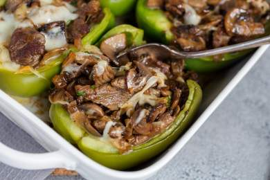

# Philly Cheesesteak Stuffed Peppers

<!-- LG:BEGIN -->
<aside class="lg-badge lg-badge--red" aria-label="Lean and Green nutrition summary">
  <header class="lg-badge__title">Lean &amp; Green</header>
  <ul class="lg-badge__rows">
    <li class="lg-badge__row lg-badge__row--green" title="Lean + leaner + leanest = 1 portion (meets).">Lean1</li>
    <li class="lg-badge__row lg-badge__row--green" title="Lean + leaner + leanest = 1 portion (meets).">Leaner0</li>
    <li class="lg-badge__row lg-badge__row--green" title="Lean + leaner + leanest = 1 portion (meets).">Leanest0</li>
    <li class="lg-badge__row lg-badge__row--red" title="Healthy fats target for this tier mix is 0 (leanest 2 / leaner 1 / lean 0).">Healthy fats1</li>
    <li class="lg-badge__row lg-badge__row--yellow" title="Lean & Green calls for 3 servings of non-starchy vegetables.">Greens2</li>
    <li class="lg-badge__row lg-badge__row--green" title="Up to 3 condiment servings per day.">Condiments2</li>
    <li class="lg-badge__row lg-badge__row--green" title="Up to 1 optional snack per day.">Snack0</li>
  </ul>
</aside>
<!-- LG:END -->

## Yields
4 Servings, 1 Lean, 2 Green, 1 Healthy Fat, 2 Condiments

## Ingredients

- [ ] 4 medium Green Bell Peppers
- [ ] 1/3 cup Yellow Onion
- [ ] 2 small Garlic Cloves
- [ ] 1/4 cup Low Sodium Beef Broth
- [ ] 6 oz Baby Bella Mushrooms
- [ ] 1 lbs Deli Roast Beef
- [ ] 4 tbsp Low-Fat Cream Cheese
- [ ] 4, 1 oz Provolone Cheese Slices

## Directions

1. Preheat oven to 400°F.
2. Slice peppers in half lengthwise, remove ribs and seeds and set aside.
3. In a large skillet, sauté the onions and garlic in broth over medium-high heat for about 5 minutes, or until onions are translucent. Add the mushrooms, and continue to cook until mushrooms are tender.
4. Mix in the roast beef and heat through, about 3 to 5 minutes. Remove skillet from heat, and stir in cream cheese.
5. Line the inside of each bell pepper with a quarter slice of cheese. Next, fill each pepper with an eighth of the roast beef mixture, then top with the another quarter slice of cheese. Repeat for remaining bell pepper halves. 
6. Bake for 15 to 20 minutes until peppers are tender and cheese on top is melted and bubbly.

 