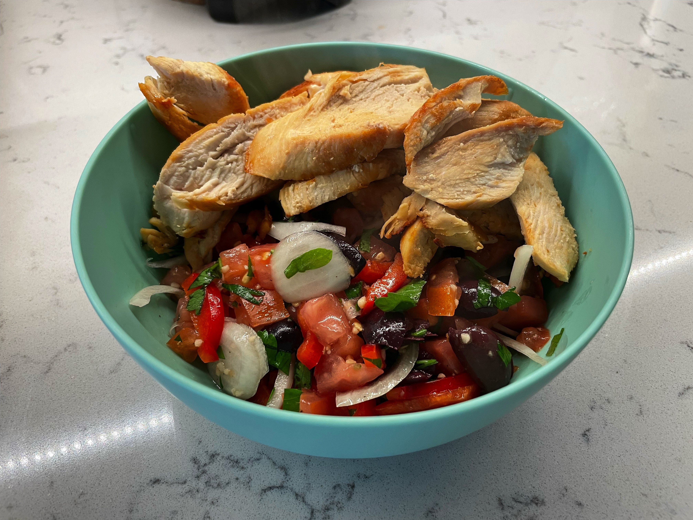

# Greek Lemon Chicken Salad

<!-- LG:BEGIN -->
<aside class="lg-badge lg-badge--yellow" aria-label="Lean and Green nutrition summary">
  <header class="lg-badge__title">Lean &amp; Green</header>
  <ul class="lg-badge__rows">
    <li class="lg-badge__row lg-badge__row--green" title="Lean + leaner + leanest = 1 portion (meets).">Lean0</li>
    <li class="lg-badge__row lg-badge__row--green" title="Lean + leaner + leanest = 1 portion (meets).">Leaner1</li>
    <li class="lg-badge__row lg-badge__row--green" title="Lean + leaner + leanest = 1 portion (meets).">Leanest0</li>
    <li class="lg-badge__row lg-badge__row--green" title="Healthy fats target for this tier mix is 1 (leanest 2 / leaner 1 / lean 0).">Healthy fats1</li>
    <li class="lg-badge__row lg-badge__row--yellow" title="Lean & Green calls for 3 servings of non-starchy vegetables.">Greens1</li>
    <li class="lg-badge__row lg-badge__row--green" title="Up to 3 condiment servings per day.">Condiments2.5</li>
    <li class="lg-badge__row lg-badge__row--green" title="Up to 1 optional snack per day.">Snack0</li>
  </ul>
</aside>
<!-- LG:END -->

Yield:
2 Serving

Per Serving:
1 Leaner
1 Green
2.5 Condiments
1 healthy fat

## Ingredients
- [ ] 1 cup cucumber, with peel
- [ ] 1 cup red bell pepper
- [ ] 1 cup tomato
- [ ] 8 black olives
- [ ] 1 lb raw boneless skinless chicken breast
- [ ] 2 tbsp onion
- [ ] 1 tsp olive oil
- [ ] 2 tbsp parsley
- [ ] 1 clove garlic
- [ ] 4 tsp lemon juice

## Directions
1. Preheat grill to medium-high heat.
2. Grill chicken 5 minutes on each side, or until cooked through. Cut into slices.
3. In a serving bowl, combine parsley, olives, and garlic.
4. Whisk in lemon juice and olive oil. 
5. Add cucumber, bell pepper, tomato, and onion. 
6. Toss to coat w/dressing. 
7. Add up to 1 tsp more of lemon juice to taste. 
8. Split salad into two servings and place 6oz chicken on top of each salad.

