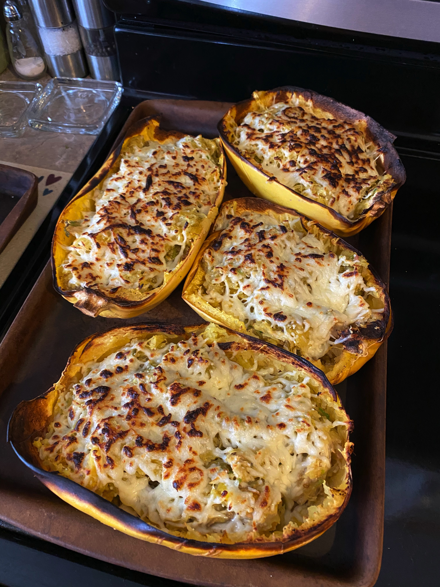

# Green Chile Chicken Enchilada Stuffed Spaghetti Squash

<!-- LG:BEGIN -->
<aside class="lg-badge lg-badge--yellow" aria-label="Lean and Green nutrition summary">
  <header class="lg-badge__title">Lean &amp; Green</header>
  <ul class="lg-badge__rows">
    <li class="lg-badge__row lg-badge__row--green" title="Lean + leaner + leanest = 1 portion (meets).">Lean0</li>
    <li class="lg-badge__row lg-badge__row--green" title="Lean + leaner + leanest = 1 portion (meets).">Leaner1</li>
    <li class="lg-badge__row lg-badge__row--green" title="Lean + leaner + leanest = 1 portion (meets).">Leanest0</li>
    <li class="lg-badge__row lg-badge__row--yellow" title="Healthy fats target for this tier mix is 1 (leanest 2 / leaner 1 / lean 0).">Healthy fats0</li>
    <li class="lg-badge__row lg-badge__row--yellow" title="Lean & Green calls for 3 servings of non-starchy vegetables.">Greens1</li>
    <li class="lg-badge__row lg-badge__row--green" title="Up to 3 condiment servings per day.">Condiments3</li>
    <li class="lg-badge__row lg-badge__row--green" title="Up to 1 optional snack per day.">Snack0</li>
  </ul>
</aside>
<!-- LG:END -->

Makes 3 servings
per serving:
1 Leaner protein
3 vegetables
3 condiments

## Ingredients
- [ ] 1 spaghetti squash – Use 3 ½ cups cooked squash
- [ ] 10 ounces cooked shredded chicken breast
- [ ] 1/2 cup green enchilada sauce
- [ ] 1 green onion, thinly sliced
- [ ] 4 ounce can diced green chilies
- [ ] 1 tablespoon chopped cilantro (optional)
- [ ] 1/4 cup cottage cheese blended smooth or greek yogurt
- [ ] 1 cup shredded low fat sharp cheddar, mozzarella or Monterey Jack cheese

## Directions

### Spaghetti Squash
1. Preheat oven to 400 degrees and line baking sheet with foil.
2. Cut the spaghetti squash in half lengthwise, spray the inside with cooking spray and sprinkle with salt and pepper.
3. Place the squash cut side down on the baking sheet and roast until tender, about 30-40 minutes.
4. Let the squash cool for about 10 minutes before scooping out the strands with a fork and placing them in a bowl.
5. Reserve the squash skins placing them cut side up back on the foil lined baking sheet.
6. Use you hands to squeeze out excess liquid from the spaghetti squash strands, then return them to the bowl.

### Green Chile Chicken Enchilada Filling
1. Preheat your oven to broil.
2. In a small saucepan over medium heat stir together the enchilada sauce, green onion, green chiles,, cilantro and shredded chicken.
3. Once the mixture is warmed through remove from the heat and stir in the Greek yogurt or cottage cheese.
4. Pour the enchilada filling in with the spaghetti squash strands and stir together until combined.
5. Scoop the filling back into the spaghetti squash shells and top with the shredded cheese.
6. Place the spaghetti squash back onto the baking sheet and broil in the oven until the cheese is browned.

