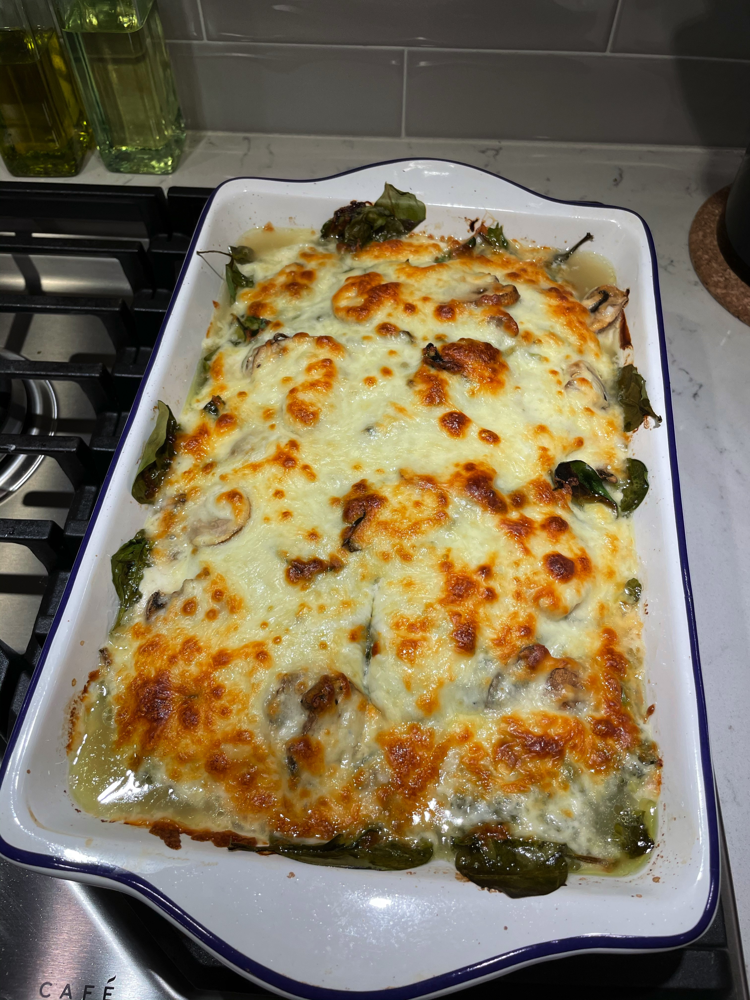

# Spinach Mushroom Chicken

<!-- LG:BEGIN -->
<aside class="lg-badge lg-badge--red" aria-label="Lean and Green nutrition summary">
  <header class="lg-badge__title">Lean &amp; Green</header>
  <ul class="lg-badge__rows">
    <li class="lg-badge__row lg-badge__row--green" title="Lean + leaner + leanest = 1 portion (meets).">Lean0</li>
    <li class="lg-badge__row lg-badge__row--green" title="Lean + leaner + leanest = 1 portion (meets).">Leaner1</li>
    <li class="lg-badge__row lg-badge__row--green" title="Lean + leaner + leanest = 1 portion (meets).">Leanest0</li>
    <li class="lg-badge__row lg-badge__row--red" title="Healthy fats target for this tier mix is 1 (leanest 2 / leaner 1 / lean 0).">Healthy fats6</li>
    <li class="lg-badge__row lg-badge__row--red" title="Lean & Green calls for 3 servings of non-starchy vegetables.">Greens4</li>
    <li class="lg-badge__row lg-badge__row--green" title="Up to 3 condiment servings per day.">Condiments0.67</li>
    <li class="lg-badge__row lg-badge__row--green" title="Up to 1 optional snack per day.">Snack0</li>
  </ul>
</aside>
<!-- LG:END -->

Makes 6 servings
Per serving
1 Leaner protein
1 vegetable
2/3 condiment
1 fat

## Ingredients
- [ ] 6 chicken breast thinly sliced (raw, butterflied) – total weight 27.3 oz ~Yields 18 oz cooked (3 leaners)
- [ ] 12 oz non-fat plain greek yogurt (1 leanest)
- [ ] 1 cup (2.54 oz) fresh mushrooms sliced (2 greens)
- [ ] 4 cups (4.24 oz) fresh baby spinach (4 greens)
- [ ] 1/2 teaspoon garlic powder (1 condiment)
- [ ] ½ teaspoon pepper (1 condiment)
- [ ] 1/2 teaspoon onion powder (1 condiment)
- [ ] 2 Tbs. olive oil (6 healthy fats)
- [ ] 1/2 cup chicken broth (1 condiment)
- [ ] 8 ounces mozzarella cheese (2 leans)

## Directions
1. In 9x13 pan line chicken in single layer, top with spinach and then mushrooms. 
2. Sprinkle with seasonings. Whisk greek yogurt with oil and broth. 
3. Pour over mixture. 
4. Lay foil over top of pan but do not seal. 
5. Cook at 375 for 20 mins, remove foil and cook uncovered for another 25 mins. 
6. Add mozzarella and cook uncovered additional 10 mins.

