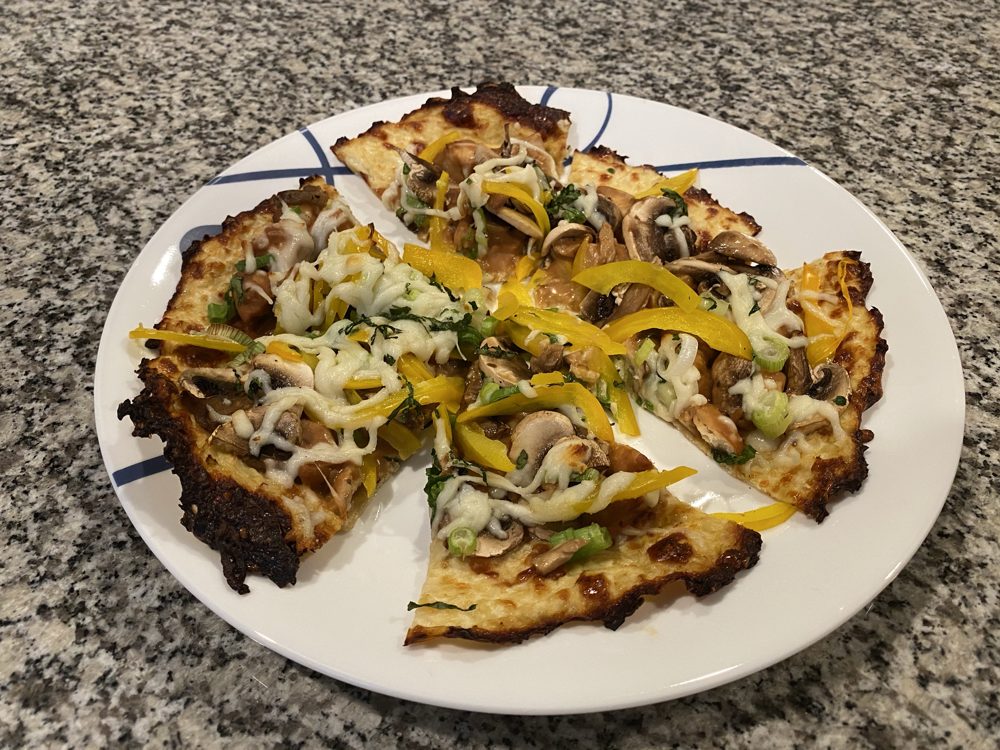

# Thai Peanut Chicken Pizza

<!-- LG:BEGIN -->
<aside class="lg-badge lg-badge--yellow" aria-label="Lean and Green nutrition summary">
  <header class="lg-badge__title">Lean &amp; Green</header>
  <ul class="lg-badge__rows">
    <li class="lg-badge__row lg-badge__row--yellow" title="Lean + leaner + leanest = 0.25 (under 1 portion).">Lean0.25</li>
    <li class="lg-badge__row lg-badge__row--yellow" title="Lean + leaner + leanest = 0.25 (under 1 portion).">Leaner0</li>
    <li class="lg-badge__row lg-badge__row--yellow" title="Lean + leaner + leanest = 0.25 (under 1 portion).">Leanest0</li>
    <li class="lg-badge__row lg-badge__row--green" title="Healthy fats target for this tier mix is 0 (leanest 2 / leaner 1 / lean 0).">Healthy fats0</li>
    <li class="lg-badge__row lg-badge__row--yellow" title="Lean & Green calls for 3 servings of non-starchy vegetables.">Greens0.25</li>
    <li class="lg-badge__row lg-badge__row--green" title="Up to 3 condiment servings per day.">Condiments2.5</li>
    <li class="lg-badge__row lg-badge__row--green" title="Up to 1 optional snack per day.">Snack1</li>
  </ul>
</aside>
<!-- LG:END -->

## Ingredients

### For the Crust
- [ ] 1 cup raw Cauliflower, grated or 100 grams (2 Greens)
- [ ] 1/4 cup Egg Beaters (1/8 Lean)
- [ ] 1/4 cup 2% Reduced Fat Mozzarella Cheese, shredded (2/8 Lean)

### Peanut Sauce
- [ ] 2 LEVELED tbsp PB2 or powdered peanut butter (1 Snack. MUST LEVELED!!!)
- [ ] 2 tbsp Walden Farms Sesame Ginger Dressing (1 Condiment)

### Toppings:
- [ ] 1 tsp Teriyaki Sauce (1 Condiment)
- [ ] 1 tsp Low Sodium Soy Sauce (1/2 Condiment)
- [ ] 5 oz raw Chicken to yield 2.25 oz Chicken (3/8 Lean)
- [ ] 1/4 cup 2% Reduced Fat Mozzarella Cheese (2/8 Lean)
- [ ] 1/4 cup or 26 grams Bean Sprouts (1/2 Green)
- [ ] 2 tbsp Red Pepper or 18.6 grams, thinly sliced (1/4 Green)
- [ ] 2 tbsp Green Onions or 12.5 grams, thinly sliced (1/4 Green)
- [ ] 1 tbsp Cilantro, chopped (Optional)

## Directions
1. Marinade raw chicken in teriyaki and soy sauce overnight. Discard marinade. Grill or cook chicken until done. Chop into small pieces. Make sure you are getting 2.25 oz cooked chicken. Set aside.

1. Preheat oven to 425 degrees. Place parchment paper on a cookie sheet and spray lightly with cooking spray. Combine grated cauliflower, egg beaters, and 1/4 cup cheese until mixed completely. Spoon mixture on prepared pan with parchment paper. Use the back of a spoon to thin out the mixture and form a circle about the size of a dinner plate without the rim. Bake for 25 to 30 minutes. Flip the pizza crust over. Bake for an additional 10 to 15 minutes.

1. Combine PB2 and Walden Farms Sesame Ginger Dressing. Add the chicken and stir until blended. Spread the chicken mixture over the top of cooked pizza crust. Top with veggies. Sprinkle 1/4 cup cheese over the top. Broil until cheese is melted about 5 minutes.

1 Complete Lean and Green Meal with 2 1/2 Condiments and 1 Snack

