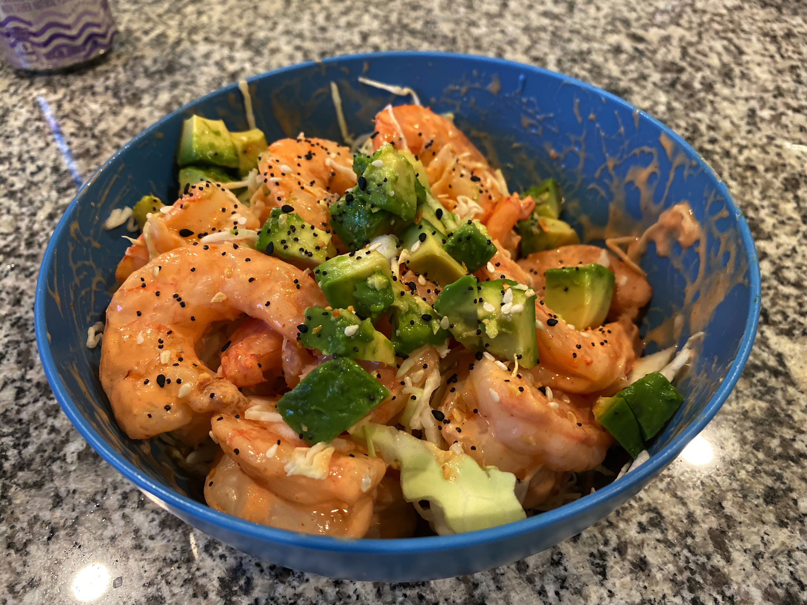

# Bang Bang Shrimp

<!-- LG:BEGIN -->
<aside class="lg-badge lg-badge--yellow" aria-label="Lean and Green nutrition summary">
  <header class="lg-badge__title">Lean &amp; Green</header>
  <ul class="lg-badge__rows">
    <li class="lg-badge__row lg-badge__row--green" title="Lean + leaner + leanest = 1 portion (meets).">Lean0</li>
    <li class="lg-badge__row lg-badge__row--green" title="Lean + leaner + leanest = 1 portion (meets).">Leaner0</li>
    <li class="lg-badge__row lg-badge__row--green" title="Lean + leaner + leanest = 1 portion (meets).">Leanest1</li>
    <li class="lg-badge__row lg-badge__row--yellow" title="Healthy fats target for this tier mix is 2 (leanest 2 / leaner 1 / lean 0).">Healthy fats1</li>
    <li class="lg-badge__row lg-badge__row--green" title="Lean & Green calls for 3 servings of non-starchy vegetables.">Greens3</li>
    <li class="lg-badge__row lg-badge__row--green" title="Up to 3 condiment servings per day.">Condiments1</li>
    <li class="lg-badge__row lg-badge__row--green" title="Up to 1 optional snack per day.">Snack0</li>
  </ul>
</aside>
<!-- LG:END -->

## Ingredients
- [ ] 7 oz of cooked shrimp in the air fryer for 3 mins (1 leanest)
- [ ] 1 1/2oz of Avocado (1 healthy fat) 
- [ ] 3.5 oz of shredded green cabbage (3 Greens) 
- [ ] 2T Lite Wishbone Thousand Island (1 healthy fat) 
- [ ] 1 tsp hot sauce/sriracha (1 condiment) 
- [ ] 1/4 tsp Everything but the bagel seasoning (Trader Joes)

## Directions
1. Heat the cooked shrimp in the air fryer for 3-5 mins at 400 degrees.  ( you can sautee in a pan with oil spray as well)
2. Add cooked shrimp to a small mixing bowl and add salad dressing and hot sauce or sriracha - toss to coat!
3. Add the shrimp unto a bed of shredded cabbage and garnish with Everything Bagel seasoning

