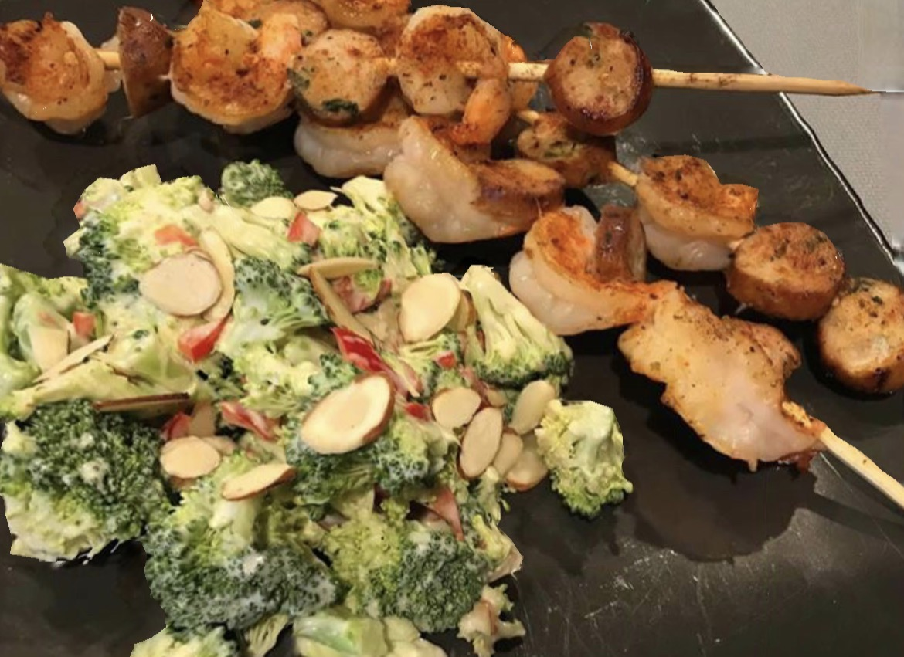

# Shrimp and sausage kabobs

<!-- LG:BEGIN -->
<aside class="lg-badge lg-badge--green" aria-label="Lean and Green nutrition summary">
  <header class="lg-badge__title">Lean &amp; Green</header>
  <ul class="lg-badge__rows">
    <li class="lg-badge__row lg-badge__row--green" title="Lean + leaner + leanest = 1 portion (meets).">Lean0</li>
    <li class="lg-badge__row lg-badge__row--green" title="Lean + leaner + leanest = 1 portion (meets).">Leaner1</li>
    <li class="lg-badge__row lg-badge__row--green" title="Lean + leaner + leanest = 1 portion (meets).">Leanest0</li>
    <li class="lg-badge__row lg-badge__row--green" title="Healthy fats target for this tier mix is 1 (leanest 2 / leaner 1 / lean 0).">Healthy fats1</li>
    <li class="lg-badge__row lg-badge__row--green" title="Lean & Green calls for 3 servings of non-starchy vegetables.">Greens3</li>
    <li class="lg-badge__row lg-badge__row--green" title="Up to 3 condiment servings per day.">Condiments2</li>
    <li class="lg-badge__row lg-badge__row--green" title="Up to 1 optional snack per day.">Snack1</li>
  </ul>
</aside>
<!-- LG:END -->

1 serving

Each serving provides
1 leaner
2 condiments
3 greens
1 healthy fat
1 snack

## Ingredients

### Kabobs
- [ ] 4 oz. raw shrimp
- [ ] 1 simple truth chicken sausage link
- [ ] 1 teaspoon BBQ seasoning spice or dry rub

### Salad
- [ ] 4 oz. raw broccoli florets
- [ ] 1/3 cup fresh chopped red peppers
- [ ] 2 1/2 tablespoons Bolthouse coleslaw dressing
- [ ] 1/2 oz. almond slivers or slices

## Directions
1. Soak your bamboo skewers overnight to prevent burning while cooking.
2. For the salad, mix all together but the almonds and refrigerate for a few hours before serving. When you serve add your nuts on top for that added crunch.
3. Slice your sausage to bite size and skewer your sausage and shrimp on your skewers. Rub with your bbq rub.
4. Cook till shrimp is no longer pink.

