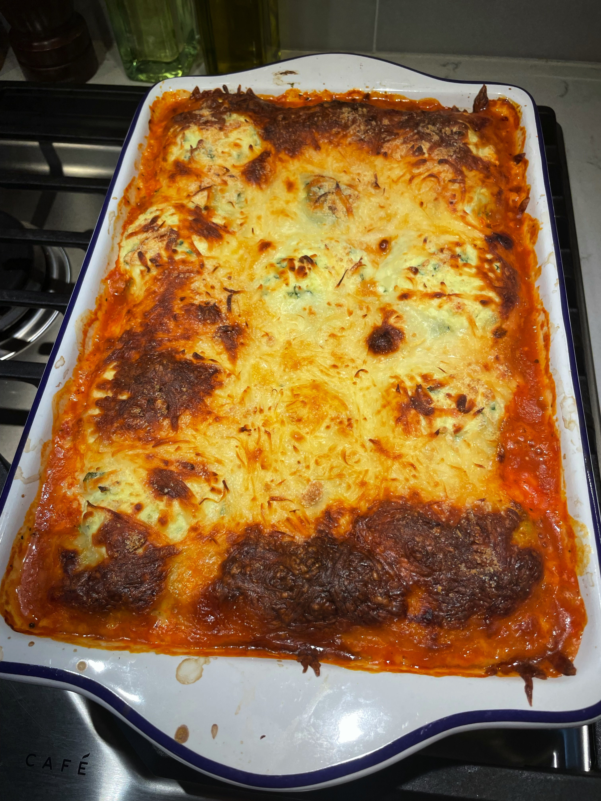

# Zucchini Ravioli

<!-- LG:BEGIN -->
<aside class="lg-badge lg-badge--yellow" aria-label="Lean and Green nutrition summary">
  <header class="lg-badge__title">Lean &amp; Green</header>
  <ul class="lg-badge__rows">
    <li class="lg-badge__row lg-badge__row--green" title="Lean + leaner + leanest = 1 portion (meets).">Lean1</li>
    <li class="lg-badge__row lg-badge__row--green" title="Lean + leaner + leanest = 1 portion (meets).">Leaner0</li>
    <li class="lg-badge__row lg-badge__row--green" title="Lean + leaner + leanest = 1 portion (meets).">Leanest0</li>
    <li class="lg-badge__row lg-badge__row--green" title="Healthy fats target for this tier mix is 0 (leanest 2 / leaner 1 / lean 0).">Healthy fats0</li>
    <li class="lg-badge__row lg-badge__row--yellow" title="Lean & Green calls for 3 servings of non-starchy vegetables.">Greens0</li>
    <li class="lg-badge__row lg-badge__row--green" title="Up to 3 condiment servings per day.">Condiments3</li>
    <li class="lg-badge__row lg-badge__row--green" title="Up to 1 optional snack per day.">Snack0</li>
  </ul>
</aside>
<!-- LG:END -->

Yield:
2 servings

Per serving:
1 Lean protein serving
3 vegetables
3 condiments

## Ingredients
- [ ] 1 1/2 cup (6 oz) fresh zucchini
- [ ] 1 cup part-skim ricotta
- [ ] 1 egg
- [ ] 1/4 c chopped fresh spinach
- [ ] 3/4 cup (6 oz) low carbohydrate marinara sauce. 5 grams of carbohydrates or less per ½ cup)

### Toppings
- [ ] 3/4 cup (3 oz) low-fat mozzarella
- [ ] 2 T parmesan

## Directions
1. Preheat the oven to 375°F.
2. Using a potato peeler, slice the two sides of each zucchini into thin flat strips, peeling until you reach the center. You will end up with 25-30 slices.
3. In a small mixing bowl, combine the ricotta, parmesan, egg, and spinach. Separately, fill the bottom of a 9×13 baking dish with the marinara sauce.
4. To assemble the zucchini ravioli: overlap two strips of squash then overlap two more strips perpendicular on top of the first strips, creating a T shape. Spoon 1 tablespoon of filling in the center of the squash then bring the ends of the strips together, overlapping each other. Turn the ravioli over and place it in the baking dish to seal the bottom.
5. Top with mozzarella and more Parmesan.
6. Bake the zucchini ravioli for 30 minutes, until the zucchini is al dente and the cheese on top is turning golden brown.

*If following plan and are adding Spinach, subtract 1/2 oz of zucchini to compensate for extra greens from spinach.

