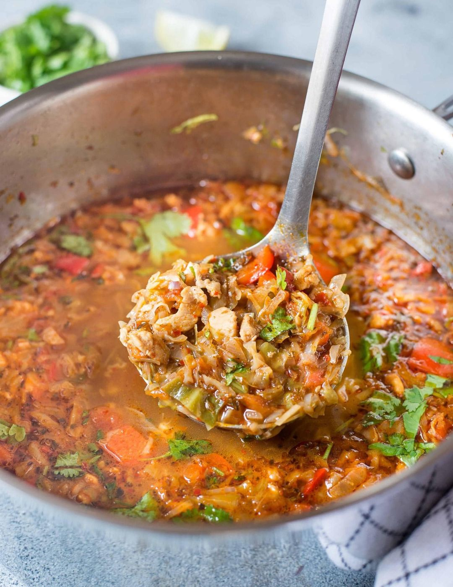

# Crockpot Chicken Taco Soup

<!-- LG:BEGIN -->
<aside class="lg-badge lg-badge--green" aria-label="Lean and Green nutrition summary">
  <header class="lg-badge__title">Lean &amp; Green</header>
  <ul class="lg-badge__rows">
    <li class="lg-badge__row lg-badge__row--green" title="Lean + leaner + leanest = 1 portion (meets).">Lean1</li>
    <li class="lg-badge__row lg-badge__row--green" title="Lean + leaner + leanest = 1 portion (meets).">Leaner0</li>
    <li class="lg-badge__row lg-badge__row--green" title="Lean + leaner + leanest = 1 portion (meets).">Leanest0</li>
    <li class="lg-badge__row lg-badge__row--green" title="Healthy fats target for this tier mix is 0 (leanest 2 / leaner 1 / lean 0).">Healthy fats0</li>
    <li class="lg-badge__row lg-badge__row--green" title="Lean & Green calls for 3 servings of non-starchy vegetables.">Greens3</li>
    <li class="lg-badge__row lg-badge__row--green" title="Up to 3 condiment servings per day.">Condiments2.25</li>
    <li class="lg-badge__row lg-badge__row--green" title="Up to 1 optional snack per day.">Snack0</li>
  </ul>
</aside>
<!-- LG:END -->

## Yield
2 servings

## Per serving
1 Lean
3 Greens
2.25 Condiments

## Ingredients
- [ ] 2 cups reduced-sodium chicken broth
- [ ] 2 cups of water
- [ ] 1 cup Rotel diced tomatoes with green chilies
- [ ] 1 teaspoon reduced-sodium taco seasoning mix
- [ ] 1/2 teaspoon cumin
- [ ] 1/4 teaspoon chili powder
- [ ] 1 clove garlic, minced
- [ ] 13-14 oz raw chicken breasts - should yield 9 oz cooked
- [ ] 2 cups cabbage, chopped (May need more because of shrinkage)
- [ ] 2 oz Kraft 2% Mexican Cheese to garnish

## Directions
1. Combine chicken broth, water, diced tomatoes, taco seasoning, cumin, chili powder, garlic, cabbage, and chicken in a crockpot. 
2. Cook on low for 6 to 8 hours or on high 3 to 4 hours. 
3. Shred chicken breasts in crockpot before serving. 
4. Pour soup into bowls and top with cheese.

