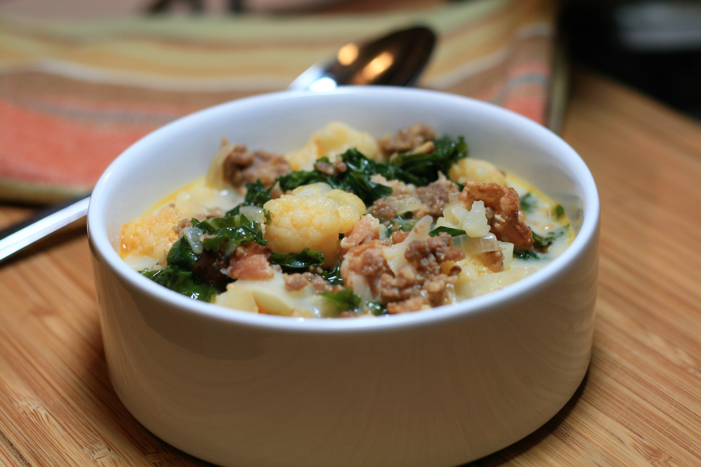

# Zuppa Toscana Soup

<!-- LG:BEGIN -->
<aside class="lg-badge lg-badge--green" aria-label="Lean and Green nutrition summary">
  <header class="lg-badge__title">Lean &amp; Green</header>
  <ul class="lg-badge__rows">
    <li class="lg-badge__row lg-badge__row--green" title="Lean + leaner + leanest = 1 portion (meets).">Lean1</li>
    <li class="lg-badge__row lg-badge__row--green" title="Lean + leaner + leanest = 1 portion (meets).">Leaner0</li>
    <li class="lg-badge__row lg-badge__row--green" title="Lean + leaner + leanest = 1 portion (meets).">Leanest0</li>
    <li class="lg-badge__row lg-badge__row--green" title="Healthy fats target for this tier mix is 0 (leanest 2 / leaner 1 / lean 0).">Healthy fats0</li>
    <li class="lg-badge__row lg-badge__row--green" title="Lean & Green calls for 3 servings of non-starchy vegetables.">Greens3</li>
    <li class="lg-badge__row lg-badge__row--green" title="Up to 3 condiment servings per day.">Condiments3</li>
    <li class="lg-badge__row lg-badge__row--green" title="Up to 1 optional snack per day.">Snack0</li>
  </ul>
</aside>
<!-- LG:END -->

(an adaptation of Olive Garden’s soup)

## Ingredients
- [ ] 4 slices turkey bacon
- [ ] 1 ½ pound Italian chicken sausage
- [ ] 4 cups cauliflower (cutting florets in half is necessary)
- [ ] ½ cup scallions
- [ ] 4 cloves garlic
- [ ] 4 cups chicken stock
- [ ] ¼ teaspoon salt
- [ ] ¼ teaspoon pepper
- [ ] 2 cups kale
- [ ] 1 ½ cup reduced-fat plain Greek yogurt
- [ ] 3 tablespoons Parmesan cheese

## Directions
1. In a large pot, cook the turkey bacon until crispy. Drain any grease, set aside. 
2. Add the sausage, breaking it apart as it cooks. Once the sausage is browned and crumbled, remove sausage and drain off any grease leaving a Tbsp to sauté the scallions, add sausage to bacon.
3. Add the scallions to the pan; sauté until translucent, add garlic, sauté until fragrant. 
4. Add the bacon and sausage back into the pot. 
5. Stir in the stock and cauliflower, season with salt and pepper and simmer for about 10 minutes or until cauliflower is tender.
6. Add kale and yogurt. Bring it to a simmer. (not a boil). 
7. Top with Parmesan cheese before serving. Enjoy!!! 

Makes 4 servings
Each serving provides:
1 lean
3 green
3 condiments

